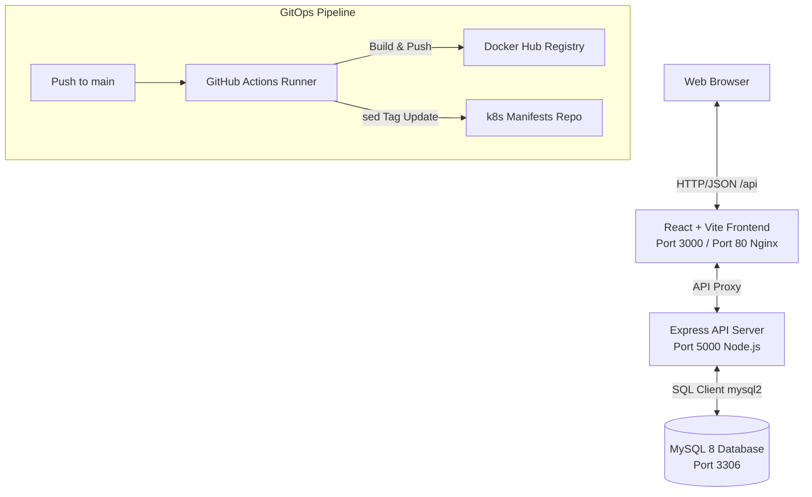
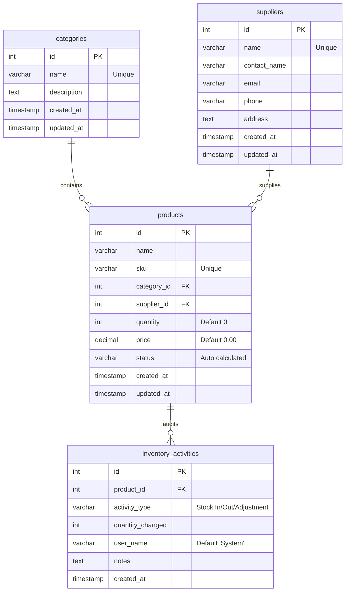

# Enterprise Inventory Management System

A production-grade, containerized monorepo implementing an **Enterprise Inventory Management System** (IMS). This project features a responsive modern React SPA frontend, an Express REST API backend, self-bootstrapping database migrations for MySQL, and is designed to integrate into GitOps deployment workflows (e.g., via ArgoCD).

---

## 🏗️ Architecture & Stack Overview

The application is structured as a decoupled frontend and backend monorepo:



### Technical Stack
* **Frontend**: React 18, Vite (Development Server & Compiler), React Router v6, Axios (with custom error-interceptors), and Vanilla CSS (custom light/dark themed variables).
* **Backend**: Node.js, Express, Helmet (HTTP header security), CORS, Morgan (HTTP logging), and MySQL 2 driver.
* **Database**: MySQL 8 (relational schema tracking products, categories, suppliers, and transaction audit trails).
* **Production Serving & Routing**: Nginx (serving build assets and acts as a local proxy fallback to the API).
* **DevOps**: Docker Multi-stage Builds, GitHub Actions, and GitOps image-tag updating logic.

---

## 📋 Features

### 💻 Frontend Viewports
* **Interactive Dashboard**: Quick metrics cards (sku count, total stock, total valuation), low-stock warning tables, recent audit activities, and data visualization charts (Category Distribution, Stock Status, Monthly Trends).
* **Products Catalog**: Complete CRUD management for products, instant Search, filter by Category or Stock Status, and auto-generated stock level flags (`In Stock`, `Low Stock`, `Out of Stock`).
* **Categories & Suppliers Directory**: CRUD tools for organizing classifications and storing contact detail cards for vendor logistics.
* **Valuation & Audit Reports**: Generates customized tables for General Summary, Out of Stock, Low Stock, or High Value items, with native CSS print-mode compatibility for paper audits.
* **System Settings**: Toggle system configurations, edit mock user tags, and switch between Light/Dark system themes (persisted via `localStorage`).

### ⚙️ Backend Capabilities
* **Automatic Database Bootstrapping**: At startup, the server automatically checks if the target tables exist. If missing, it builds the schema and loads seeds dynamically.
* **Robust Error & Security Handlers**: Express error middlewares return clean JSON responses. CORS and security header protections are managed via `helmet`.
* **Kubernetes Probes Support**: A custom `/api/health` endpoint pings the MySQL database to determine availability, enabling reliable K8s liveness/readiness orchestration.

---

## 🗄️ Database Schema

The database contains four interconnected tables designed for referential integrity:



* **Status Rules**: Product status is automatically calculated on database insertion/update:
  * `0` Units $\rightarrow$ **Out of Stock**
  * `1` to `20` Units $\rightarrow$ **Low Stock**
  * $> 20$ Units $\rightarrow$ **In Stock**

---

## 📂 Project Structure

```text
├── .github/
│   └── workflows/
│       └── ci-cd.yml          # GitHub Actions Docker build & GitOps tagging
├── backend/
│   ├── config/
│   │   └── db.js              # Database connection pool setup
│   ├── controllers/           # API handlers for Products, Categories, Suppliers, Dashboard
│   ├── database/
│   │   ├── initDb.js          # Self-bootstrapping script
│   │   ├── schema.sql         # Table creation schemas
│   │   └── seed.sql           # Initial database records
│   ├── middleware/            # Error handling logic
│   ├── models/                # SQL queries wrapped in Classes
│   ├── routes/                # Express routing endpoints
│   ├── .env                   # Local backend configuration
│   ├── package.json
│   └── server.js              # Express entrypoint
├── frontend/
│   ├── dist/                  # Compiled React production assets
│   ├── nginx.conf             # Production container Nginx SPA router & proxy
│   ├── src/
│   │   ├── components/        # Shell UI (Navbar, Sidebar, Charts, Modals)
│   │   ├── pages/             # Dynamic views (Dashboard, Products, Reports, etc.)
│   │   ├── utils/
│   │   │   └── api.js         # Central Axios instance with response formatting
│   │   ├── App.jsx            # Main SPA Layout Router
│   │   ├── index.css          # Theme system and layout styling
│   │   └── main.jsx           # React DOM bootstrap
│   ├── package.json
│   └── vite.config.js         # Vite configuration with local /api proxy setup
├── Dockerfile.backend         # Production Docker file for Backend
├── Dockerfile.frontend        # Production Multi-stage Docker file for Frontend
└── README.md                  # This documentation
```

---

## 🚀 Getting Started (Local Development)

### Prerequisites
* **Node.js** (v18 or higher recommended)
* **MySQL Server** (v8.x recommended)

### 1. Database Setup
Ensure you have a MySQL server running. Create a database name matches the config or let the bootstrapper create `inventory_db` automatically. 

### 2. Configure Backend Environment
Create a `backend/.env` file with your credentials:
```env
PORT=5000
DB_HOST=localhost
DB_PORT=3306
DB_USER=your_mysql_username
DB_PASSWORD=your_mysql_password
DB_NAME=inventory_db
NODE_ENV=development
```

### 3. Start Backend Services
```bash
cd backend
npm install
npm run dev
```
The server will boot, run schemas/seeds, and listen on **`http://localhost:5000`**.

### 4. Start Frontend Client
```bash
cd frontend
npm install
npm run dev
```
Vite will compile files and start the client on **`http://localhost:3000`**. Vite's internal development proxy will automatically route all `/api/*` traffic to the backend server running at `http://localhost:5000`.

---

## 🐳 Containerization & Deployment

### Local Docker Build
Both containers can be built locally using the respective Dockerfiles located at the root of the project:

```bash
# Build Backend
docker build -t inventory-backend:1.0 -f Dockerfile.backend ./backend

# Build Frontend
docker build -t inventory-frontend:1.0 -f Dockerfile.frontend ./frontend
```

* **Frontend Container Behavior**: The Nginx container runs on port 80. It serves compiled React files and is configured via `frontend/nginx.conf` to proxy `/api/` requests to `http://ims-backend-service:5000/api/` as a network fallback if an external ingress controller is not present.

---

## 🔄 CI/CD & GitOps Integration

The pipeline inside [ci-cd.yml](file:///.github/workflows/ci-cd.yml) implements a GitOps continuous deployment flow:

1. **Trigger Condition**: Executes on a push to `main` branch when changes are detected in `frontend/`, `backend/`, `k8s/`, or the workflow file.
2. **Build and Push**:
   * Compiles the code and pushes the generated Docker containers to **Docker Hub** (using credentials from GitHub secrets: `DOCKERHUB_USERNAME` and `DOCKERHUB_TOKEN`).
   * Tags the images with both `:latest` and the unique Git Commit SHA (`${{ github.sha }}`).
3. **Manifest Tag Update**:
   * Uses `sed` to replace the old container image tags inside target Kubernetes manifests:
     * `k8s/deployment-frontend.yaml`
     * `k8s/deployment-backend.yaml`
4. **Git Commit & Push**:
   * Commits the updated manifests back to the repo under `chore: update image tags to [sha] [skip ci]` to trigger GitOps agents (like ArgoCD) to synchronize the deployment state inside the cluster..
